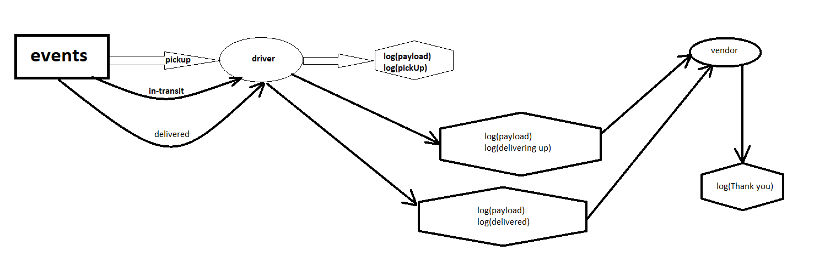

# caps

[PR](https://github.com/mohammed-khamees/caps/pull/1)

## how to work with this repo:

1. `npm init -y`
2. `npm i faker`
3. `npm i -D jest`

**On the `package.json` change the `script` to**

```
"scripts": {
    "start": "node index.js",
    "test": "jest --verbose --coverage"
}

```


